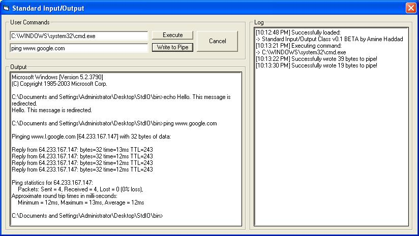

## Standard Input/Output Complete\!

### Description

This program is one of a kind, and I don't say that because it can read output of another application but because, for the first time, it can send input from vb as well! Please, it took me a few days to code this, so if you like it, then please vote. I would also like to thank 2 friends of mine, Zak and Espen for their help in debugging this bloody program.
 
### More Info
 

             |
---                |---
**Submitted On**   |2005-06-19 22:27:32
**By**             |[Amine Haddad](https://github.com/Planet-Source-Code/PSCIndex/blob/master/ByAuthor/amine-haddad.md)
**Level**          |Advanced
**User Rating**    |5.0 (15 globes from 3 users)
**Compatibility**  |VB 4\.0 \(32\-bit\), VB 5\.0, VB 6\.0
**Category**       |[Files/ File Controls/ Input/ Output](https://github.com/Planet-Source-Code/PSCIndex/blob/master/ByCategory/files-file-controls-input-output__1-3.md)
**World**          |[Visual Basic](https://github.com/Planet-Source-Code/PSCIndex/blob/master/ByWorld/visual-basic.md)
**Archive File**   |[Standard\_I1903656192005\.ZIP](https://github.com/Planet-Source-Code/amine-haddad-standard-input-output-complete__1-61249/archive/master.zip)

